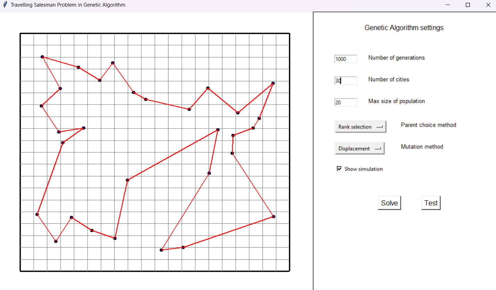

# Travelling Salesman Problem - Genetic Algorithm

## Introduction
The Travelling Salesman Problem (TSP) is a classic optimization problem where the goal is to find the shortest possible tour that visits a set of cities and returns to the starting city. In this document, we will discuss the implementation of a Genetic Algorithm to solve the TSP.

## Genetic Algorithm Overview
A Genetic Algorithm (GA) is a heuristic optimization technique inspired by the process of natural selection. It uses concepts such as selection, crossover, and mutation to evolve a population of candidate solutions over several generations. The algorithm aims to find an optimal solution by mimicking the process of natural evolution.

## Algorithm Steps

### 1. Initialization
- Generate an initial population of possible solutions (chromosomes), where each chromosome represents a possible tour.

### 2. Fitness Evaluation
- Evaluate the fitness of each chromosome in the population based on the total distance of the corresponding tour.

### 3. Selection
- Select individuals from the population to form a mating pool. Selection is typically based on the fitness of the individuals.
    - Examples of selection mechanisms:
        - Roulette wheel selection
        - Tournament selection
        - Rank selection

### 4. Crossover
- Apply crossover (recombination) to pairs of parents from the mating pool to create new offspring (children).
    - Crossover Operator: Partially Matched Crossover (PMX)

### 5. Mutation
- Apply mutation to some of the offspring to introduce small random changes in the tours.
    - Mutation Operators:
        - Swap mutation (randomly selected 2 coordinates in chromosome and swap them)
        - Displacement mutation (randomly selected 3 or 4 length section in chromosome and placed at a randomly selected place)

### 6. Replacement
- Replace the old population with the new population of offspring.

### 7. Termination
- Repeat steps 2 to 6 for a specified number of generations or until a convergence criterion is met.
    - Termination Criteria: Maximum number of generations.

## Program

